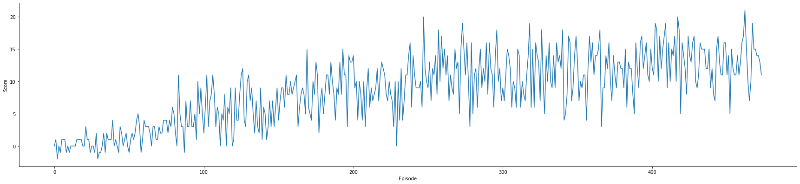

# Udacity Project 1 Report
Matt Eland, Deep Reinforcement Learning

See [Readme.md](README.md) for details on code and file locations for grading purposes.

## Learning Algorithm

This model was trained using Deep Q Learning (DQL) using Unity ML agents.

The underlying model had a neural network with 2 hidden layers plus input and output layers. The hidden layers each had 64 nodes in their layers.

I accepted the following hyper-parameters for my model training process:

- n_episodes (int): maximum number of training episodes
- max_t (int): maximum number of timesteps per episode
- eps_start (float): starting value of epsilon, for epsilon-greedy action selection
- eps_end (float): minimum value of epsilon
- eps_decay (float): multiplicative factor (per episode) for decreasing epsilon
- window_size (int): the number of most recent scores to use when averaging performance
- threshold (float): when the algorithm should early exit the training process once a minimum window score is reached

## Performance

While I do not believe my hyperparameters were an optimal set, they did result in adequate performance to train an agent capable of meeting the minimum score in 474 episodes.

Here is a line chart of the model's performance over its episodes:



This clearly shows a gradual increase over time of model performance, then hitting a plateau of sorts as the model approached the target marker.

This is echoed in the live telemetry I captured from the various episodes:

```txt
Episode 50	Average Score: 0.447
Episode 100	Average Score: 1.85
Episode 150	Average Score: 4.42
Episode 200	Average Score: 7.14
Episode 250	Average Score: 8.91
Episode 300	Average Score: 10.34
Episode 350	Average Score: 11.43
Episode 400	Average Score: 11.52
Episode 450	Average Score: 12.63
Episode 474	Average Score: 13.02
```

## Areas for Improvement

I am not convinced that the neural network architecture or the hyperparameters used were optimal for this training scenario. I'd like to do a grid-based search for the hyper-parameters that would help minimize the episodes needed to get to a satisfactory score.

The neural network architecture could be attempted in a similar way, though I suspect it might require more in-depth modifications to the agent / Unity interaction.

Overall, the system performs adequately to train an effective agent using Q Learning.

## Sample Playthrough

See [this YouTube video](https://youtu.be/5HWm26aesf4) for a recording of the application in action
